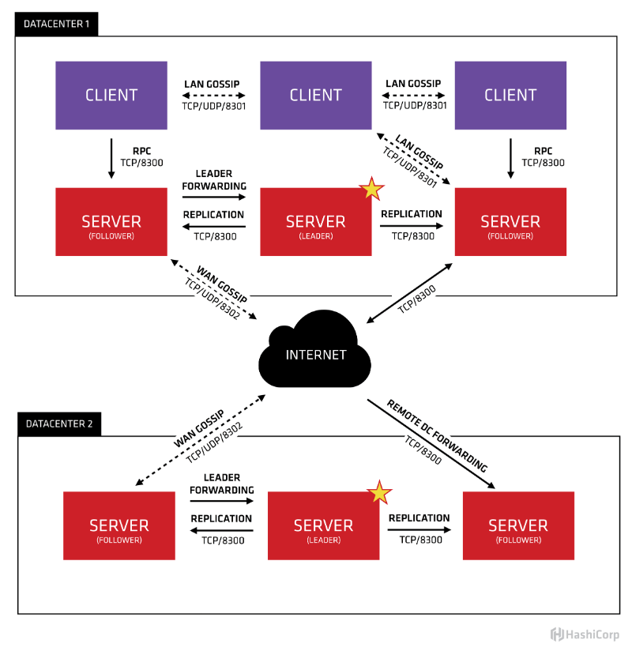

# 配置consul 服务发现集群 docker-composer 


# 配置 参数详解
- -server - 此标志用于控制代理是否处于服务器或客户端模式。提供时，代理将充当领事服务器。每个Consul集群必须至少有一个服务器，理想情况下每个数据中心不超过5个。所有服务器都参与Raft一致性算法，以确保事务以一致的，可线性化的方式进行。事务修改所有服务器节点上维护的集群状态，以确保节点发生故障时的可用性。服务器节点还参与其他数据中心中服务器节点的WAN八卦池。服务器充当其他数据中心的网关，并根据需要转发流量
- -bootstrap - (标准该server 是否为leader)该标志用于控制服务器是否处于“引导”模式。每个数据中心最多只能运行一个服务器，这一点很重要。从技术上讲，一个处于引导模式的服务器可以自我选择为Raft领导者。只有一个节点处于这种模式非常重要; 否则，一致性不能保证，因为多个节点能够自我选择。不建议在引导群集后使用此标志
- -bootstrap-expect - 此标志提供数据中心中预期服务器的数量。不应该提供此值，或者该值必须与群集中的其他服务器一致。提供时，Consul会等待指定数量的服务器可用，然后引导群集。这允许初始领导者自动选举。这不能与遗留-bootstrap标志结合使用。该标志需要-server模式。
- -ui - 启用内置的Web UI服务器和所需的HTTP路由。这消除了将Consul Web UI文件与二进制文件分开维护的需要
- -data-dir：提供一个目录用来存放agent的状态，所有的agent都需要该目录，该目录必须是稳定的，系统重启后都继续存在。
- -disable-host-node-id - 将此设置为true将阻止Consul使用来自主机的信息生成确定性节点标识，并将生成随机节点标识，该标识将保留在数据目录中。在同一台主机上运行多个Consul代理进行测试时，这非常有用。Consul在版本0.8.5和0.8.5之前缺省为false，因此您必须选择加入基于主机的ID。基于主机的ID是使用https://github.com/shirou/gopsutil/tree/master/host生成的，与HashiCorp的Nomad共享 ，因此如果您选择加入基于主机的ID，则Consul和Nomad将使用信息在主机上在两个系统中自动分配相同的ID。
- -join - 启动时加入的另一位代理的地址。这可以指定多次以指定多个代理加入。如果Consul无法加入任何指定的地址，代理启动将失败。默认情况下，代理在启动时不会加入任何节点。请注意，retry_join在自动执行Consul集群部署时，使用 可能更适合帮助缓解节点启动竞争条件。

    在Consul 1.1.0和更高版本中，这可以设置为 go-sockaddr 模板


- -retry-join- 类似于-join第一次尝试失败时允许重试连接。这对于知道地址最终可用的情况很有用。该列表可以包含IPv4，IPv6或DNS地址。在Consul 1.1.0和更高版本中，这可以设置为 go-sockaddr 模板。如果Consul正在非默认的Serf LAN端口上运行，则必须指定。IPv6必须使用“括号”语法。如果给出多个值，则按照列出的顺序尝试并重试它们，直到第一个成功为止。这里有些例子：
```
 Using a DNS entry
$ consul agent -retry-join "consul.domain.internal"
 Using IPv4
$ consul agent -retry-join "10.0.4.67"
 Using IPv6
$ consul agent -retry-join "[::1]:8301"
```
从Consul 0.9.1开始，retry-join使用go-discover库接受使用云元数据进行自动集群加入的统一接口 。有关更多信息，请参阅云端自动加入页面。
```
 Using Cloud Auto-Joining
$ consul agent -retry-join "provider=aws tag_key=..."
```


# Consul 架构
consul 的架构是什么，官方给出了一个很直观的图片



单独看数据中心 1，可以看出 consul 的集群是由 N 个 SERVER，加上 M 个 CLIENT 组成的。而不管是 SERVER 还是 CLIENT，都是 consul 的一个节点，所有的服务都可以注册到这些节点上，正是通过这些节点实现服务注册信息的共享。除了这两个，还有一些小细节，一一简单介绍。

## CLIENT

- CLIENT 表示 consul 的 client 模式，就是客户端模式。是 consul 节点的一种模式，这种模式下，所有注册到当前节点的服务会被转发到 SERVER，本身是不持久化这些信息。

## SERVER

- SERVER 表示 consul 的 server 模式，表明这个 consul 是个 server，这种模式下，功能和 CLIENT 都一样，唯一不同的是，它会把所有的信息持久化的本地，这样遇到故障，信息是可以被保留的。

## SERVER-LEADER

- 中间那个 SERVER 下面有 LEADER 的字眼，表明这个 SERVER 是它们的老大，它和其它 SERVER 不一样的一点是，它需要负责同步注册的信息给其它的 SERVER，同时也要负责各个节点的健康监测。